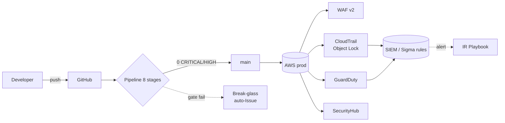

# FleetSec SecOps · Prueba Técnica

> Trabajo entregable para la **Prueba Técnica de Ingeniero de Ciberseguridad** de FleetSec S.A.S. (Quantum Data Processing Colombia).
> Autor: Juan Andrés Moya · Período: 2026-06-15 → 2026-06-21 (7 días hábiles).

[](https://conventionalcommits.org)
[](LICENSE)
<!-- CI badge se agrega en Sprint 1 cuando el workflow security.yml esté en main -->

---

## 📋 Índice

1. [Visión general](#-visión-general)
2. [Entregables](#-entregables)
3. [Arquitectura](#-arquitectura)
4. [Cómo correrlo](#-cómo-correrlo)
5. [Testing](#-testing)
6. [Tabla de cumplimiento](#-tabla-de-cumplimiento)
7. [AI Report](#-ai-report)
8. [Sustentación](#-sustentación)
9. [Tracking](#-tracking)
10. [Autor](#-autor)

---

## 🎯 Visión general

FleetSec maneja telemetría de **~60.000 vehículos** con datos personales bajo **Ley 1581 de 2012** (PDP Colombia) y proceso de certificación **ISO 27001:2022** en curso. Esta entrega cubre 5 piezas end-to-end:

| # | Entregable | Peso | Carpeta | Estado |
|---|---|---|---|---|
| 01 | DevSecOps Pipeline + App vulnerable | 25% | [`pipeline/`](pipeline/) · [`app/`](app/) | ⏳ Sprint 1 |
| 02 | VAPT — 10 vulnerabilidades + remediación | 25% | [`vapt/`](vapt/) | ⏳ Sprint 2 |
| 03 | AWS Terraform Hardening | 20% | [`terraform/`](terraform/) | ⏳ Sprint 3 |
| 04 | Incident Response Playbook | 20% | [`ir/`](ir/) | ⏳ Sprint 4 |
| 05 | Documentación + Sustentación | 10% | [`docs/`](docs/) | ⏳ Sprint 5 |

**Bonus pursueibles:** docker-compose ✓, ≥3 vulns extra ✓, Conventional Commits 100% ✓.

---

## 📦 Entregables

### Entregable 01 · DevSecOps Pipeline
- **Pipeline GitHub Actions** ≤ 15 min con 8 stages activos: pre-commit → SAST (Semgrep) → SCA (Trivy fs) → Container (Trivy image) → IaC (Checkov) → DAST (ZAP authenticated) → SBOM (CycloneDX) → Secrets (Gitleaks). Workflow: [`.github/workflows/security.yml`](.github/workflows/) *(se entrega en Sprint 1).*
- **App vulnerable** desplegable con `docker compose up` en < 5 min — cobertura de los 10 vectores del Entregable 02.
- **Break-glass workflow** auto-crea Issue con metadata obligatoria. Doc: [`docs/break-glass.md`](docs/break-glass.md).
- **Política de supresión auditada** con formato canónico Rule/Reason/Date/Responsible/Review-by. Doc: [`docs/suppression-policy.md`](docs/suppression-policy.md).

### Entregable 02 · VAPT
- **10 fichas** en [`vapt/findings/`](vapt/findings/) con CWE + OWASP + ASVS + CVSSv3.1 vector + PoC reproducible.
- **≥ 8 remediaciones** con test dual (malicioso rechazado + legítimo OK).
- **Reporte DOCX en español** ejecutivo + técnico — generado con Node.js `docx` library.
- **Bonus:** vulnerabilidades extra documentadas con la misma rigurosidad.

### Entregable 03 · Terraform AWS Hardening
- **Módulo** [`terraform/modules/security-baseline/`](terraform/modules/) cubriendo IAM · KMS · S3 · VPC · RDS · Secrets · CloudTrail · Config · GuardDuty · SecurityHub · WAF v2.
- **Tabla de cumplimiento** ≥ 10 controles mapeados a **CIS v1.4** + **ISO 27001:2022** + **Ley 1581**. Ver [`terraform/COMPLIANCE.md`](terraform/COMPLIANCE.md) *(Sprint 3)*.
- `terraform validate` y `checkov` limpios.

### Entregable 04 · Incident Response
- **Playbook NIST 800-61 r2** (6 fases) con AWS CLI **ejecutable**: [`ir/playbook.md`](ir/playbook.md).
- **IOCs enriquecidos** (VT + AbuseIPDB + Shodan + OTX): [`ir/iocs.md`](ir/iocs.md).
- **4 reglas Sigma** + **matriz MITRE ATT&CK** ≥ 6 técnicas: [`ir/detections/`](ir/) y [`ir/mitre-mapping.md`](ir/).
- **RCA** + **CEO 1-pager** + **notificación SIC (Ley 1581)** + **plan P1/P2/P3**.

### Entregable 05 · Documentación
- **ADRs** ≥ 5 en [`docs/ADRs/`](docs/ADRs/) (Michael Nygard format).
- **Diagramas** as-is / to-be en [`docs/architecture/`](docs/architecture/) (Mermaid C4 + draw.io).
- **AI Report** ≤ 150 palabras en [`docs/ai-report.md`](docs/ai-report.md) — sección comprimida en este README.
- **Video sustentación** YouTube unlisted ≤ 10 min con cámara visible — link al final.

---

## 🏗️ Arquitectura

> El diagrama detallado se entrega en Sprint 5 en [`docs/architecture/`](docs/architecture/). Esquema de alto nivel:



---

## 🚀 Cómo correrlo

### Prerrequisitos
- Docker Desktop / Docker Engine ≥ 24
- Node.js ≥ 20 (para Husky + commitlint locales)
- Terraform ≥ 1.6 (Sprint 3)
- AWS CLI v2 + cuenta con permisos para `terraform plan` (Sprint 3 — solo plan, no apply)

### Setup local (devs nuevos)

```bash
git clone https://github.com/<owner>/fleetsec-secops.git
cd fleetsec-secops
npm ci                          # Instala husky + commitlint
npx husky install               # Activa pre-commit hooks
```

### Levantar app vulnerable (Sprint 1)
```bash
cd app/
docker compose up --build
# App disponible en http://localhost:3000 (puerto exacto se confirma en Sprint 1)
```

### Correr pipeline localmente (act, opcional)
```bash
brew install act               # macOS; ver act docs para Linux
act -W .github/workflows/security.yml
```

### Verificar Terraform (Sprint 3)
```bash
cd terraform/
terraform init
terraform validate
checkov -d . --framework terraform
```

---

## 🧪 Testing

- **Pipeline**: ver [`pipeline/README.md`](pipeline/) para instrucciones de cómo retestear cada stage.
- **VAPT**: ver [`vapt/README.md`](vapt/) para reproducir cualquiera de las 10 PoCs (cada finding tiene curl ejecutable).
- **Terraform**: `terraform plan` produce el output esperado; sanity check de la tabla de cumplimiento con `scripts/verify-compliance.sh`.

---

## 📊 Tabla de cumplimiento

> Versión completa en [`terraform/COMPLIANCE.md`](terraform/COMPLIANCE.md) *(Sprint 3)*. Resumen condensado:

| Control | CIS v1.4 | ISO 27001:2022 | Ley 1581 | Status |
|---|---|---|---|---|
| Root MFA enabled | 1.5 | A.5.16 | Art. 4 | ⏳ |
| IAM password policy ≥14 chars | 1.8-1.11 | A.5.17 | Art. 4 | ⏳ |
| No SG ingress 0.0.0.0/0 on 22/3389 | 5.2 / 5.3 | A.8.20 | Art. 4 | ⏳ |
| Encryption at rest (CMK) | 2.1.1, 2.2.1 | A.8.24 | Art. 4 | ⏳ |
| CloudTrail multi-region | 3.1 | A.8.15 | Art. 4 | ⏳ |
| GuardDuty enabled | — | A.8.16 | Art. 4 | ⏳ |
| S3 BPA + Object Lock | 2.1.5 | A.8.10 | Art. 4 | ⏳ |
| RDS Multi-AZ | — | A.5.30 | Art. 17 | ⏳ |
| Object Lock en logs | — | A.8.15 | Art. 4 | ⏳ |
| WAF managed rules | — | A.8.20 | Art. 4 | ⏳ |

---

## 🤖 AI Report

> Versión completa: [`docs/ai-report.md`](docs/ai-report.md). Resumen ≤ 150 palabras (mandatorio según brief):

**Tools y tareas:** claude.ai (proyecto principal) — generación de skills personalizados de seguridad, drafting de reglas Sigma, plantillas Terraform, redacción de fichas VAPT en español, generación de DOCX con `docx` package.

**Una alucinación detectada y corregida:** al generar la regla Sigma de bulk S3 GetObject, Claude usó sintaxis de aggregation `| count() by ... > N within Xm` como spec core de Sigma. Validé contra la spec oficial: la aggregation es **extensión backend-specific** (Splunk/Sentinel), no parte del estándar Sigma. Corregí documentando el caveat y eligiendo `splunk` como target backend.

**Tareas que NO delego a IA sin supervisión:** decisiones de severidad/riesgo finales, ejecución de AWS CLI sobre cuentas reales (`--dry-run` primero), clasificación de PII bajo Ley 1581, supresiones de gates de seguridad.

*Documento de IA actualizado incrementalmente — ver historial en `docs/ai-report.md`.*

---

## 🎥 Sustentación

📺 **Video YouTube (unlisted, ≤ 10 min, cámara visible):** _(link se agrega tras grabación en D7)_
📝 **Transcript:** [`docs/sustentacion-transcript.md`](docs/) *(D7)*.

---

## 📈 Tracking

| Sistema | Link |
|---|---|
| Jira FSEC | https://jandresmoya982.atlassian.net/jira/software/projects/FSEC |
| Confluence cronograma | https://jandresmoya982.atlassian.net/wiki/x/AgCr |

**Estado actual:**
- Sprint 0 (Fundación): 🟢 60% → 100% al cerrar este repo + AI Report
- Sprints 1-5: en backlog, 25 historias creadas en Jira con epics + blocks links

---

## 👤 Autor

**Juan Andrés Moya** · [GitHub](https://github.com/) · Ingeniero de Ciberseguridad
Bogotá, Colombia · 2026-06-15

---

## 📄 Licencia

MIT — ver [LICENSE](LICENSE).
