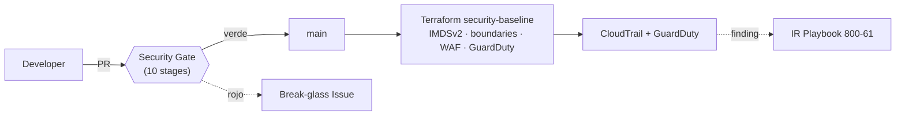

# FleetSec SecOps · Prueba Técnica

> Entregable de la **Prueba Técnica de Ingeniero de Ciberseguridad** de FleetSec S.A.S. (Quantum
> Data Processing Colombia). Autor: **Juan Andrés Moya** · Bogotá, Colombia.

[](https://github.com/Juan1202/fleetsec-secops/actions/workflows/security.yml)
[](https://conventionalcommits.org)
[](LICENSE)

---

## 📋 Índice

1. [Visión general](#-visión-general)
2. [La narrativa de sistema (el diferenciador)](#-la-narrativa-de-sistema-el-diferenciador)
3. [Entregables](#-entregables)
4. [Arquitectura](#️-arquitectura)
5. [Cómo correrlo](#-cómo-correrlo)
6. [Tabla de cumplimiento](#-tabla-de-cumplimiento)
7. [AI Report](#-ai-report)
8. [Sustentación](#-sustentación) · [Tracking](#-tracking) · [Autor](#-autor)

---

## 🎯 Visión general

FleetSec maneja telemetría de **~60.000 vehículos** con datos personales bajo **Ley 1581 de 2012**
(PDP Colombia) y certificación **ISO 27001:2022** en curso. La entrega cubre 5 piezas end-to-end,
**todas completas y con el pipeline de seguridad en verde**:

| # | Entregable | Peso | Carpeta | Estado |
|---|---|---|---|---|
| 01 | DevSecOps Pipeline + App vulnerable | 25% | [`pipeline/`](pipeline/) · [`app/`](app/) | ✅ Completo |
| 02 | VAPT — 11 vulnerabilidades + remediación + bonus | 25% | [`vapt/`](vapt/) | ✅ Completo |
| 03 | AWS Terraform Hardening | 20% | [`terraform/`](terraform/) | ✅ Completo |
| 04 | Incident Response Playbook | 20% | [`ir/`](ir/) | ✅ Completo |
| 05 | Documentación + Sustentación | 10% | [`docs/`](docs/) | ✅ Docs · 🎥 video |

**Bonus:** docker-compose ✓ · vulns extra (B-01, V-11) ✓ · Conventional Commits 100% (merge/rebase,
nunca squash) ✓.

---

## 🧵 La narrativa de sistema (el diferenciador)

Los cuatro entregables técnicos **no son piezas aisladas**: son un mismo sistema donde cada una
refuerza a la otra, unidas por un solo hilo — el **SSRF V-03**.

```
Sprint 2 (VAPT)          Sprint 3 (Terraform)           Sprint 4 (IR)
──────────────           ────────────────────           ─────────────
V-03 SSRF        ──►      IMDSv2 required corta   ◄──    el breach ocurre si NO se mitiga:
lo ENCUENTRA             la cadena de robo de           el IR lo RESPONDE (RCA identifica
                         credenciales (PREVIENE)        V-03 como causa raíz)
```

- **Sprint 2** encontró el SSRF (V-03) y lo documentó con PoC.
- **Sprint 3** lo mitiga a nivel infraestructura (**IMDSv2** en el launch template) y añade las capas
  (permission boundary, GuardDuty, Object Lock) que rompen cada eslabón del breach.
- **Sprint 4** demuestra qué pasa **si esas capas no están** (el breach IR-2026-001) y cómo responder;
  el [RCA](ir/rca.md) identifica el V-03 (técnica MITRE **T1552.005**, robo de credenciales del IMDS)
  como el punto de entrada.

**VAPT encuentra → Terraform previene → IR responde.** Los diagramas as-is/to-be y el timeline del
breach con overlay ATT&CK están en [`docs/architecture/`](docs/architecture/).

---

## 📦 Entregables

### 01 · DevSecOps Pipeline ([`pipeline/`](pipeline/) · [`app/`](app/))
Pipeline GitHub Actions con **10 stages** → **Security Gate** (único *required check*): Commitlint ·
Tests · SAST (Semgrep) · SCA (Trivy) · Container (Trivy) · IaC (Checkov) · DAST (ZAP autenticado) ·
SBOM (Syft/CycloneDX) · Secrets (gitleaks) · Suppressions Audit. App vulnerable Spring Boot
(`docker compose up`) con 11 vectores. **Break-glass** ([`docs/break-glass.md`](docs/break-glass.md))
y **política de supresión auditada** ([`docs/suppression-policy.md`](docs/suppression-policy.md)) con
formato canónico de 5 campos, validado en CI.

### 02 · VAPT ([`vapt/`](vapt/))
**11 fichas** (V-01…V-11) + **2 bonus** (B-01 security headers, B-02 CORS N/A) con CWE + OWASP +
ASVS + CVSSv3.1 con vector + PoC reproducible. **11/11 remediadas** con test dual (payload rechazado
+ flujo legítimo OK). Reporte **DOCX** ejecutivo + técnico + análisis de interacción + cumplimiento
([`vapt/reports/`](vapt/reports/), generado con `python-docx`).

### 03 · Terraform AWS Hardening ([`terraform/`](terraform/))
Módulo [`security-baseline`](terraform/modules/security-baseline/): IAM (permission boundaries) · KMS
(CMK/servicio) · S3 (BPA + Object Lock) · VPC 3-tier + Flow Logs · RDS Multi-AZ · CloudTrail + Config
+ GuardDuty + Security Hub · WAF v2 · IMDSv2. **18 controles** mapeados a CIS v1.4 + ISO 27001:2022 +
Ley 1581 + NIST 800-53 ([`terraform/COMPLIANCE.md`](terraform/COMPLIANCE.md)). `validate` + `tflint` +
`checkov` + `trivy config` **limpios**.

### 04 · Incident Response ([`ir/`](ir/))
Playbook **NIST 800-61 r2** (6 fases) con AWS CLI **ejecutable** + rollback ([`ir/playbook.md`](ir/playbook.md)).
IOCs enriquecidos ([`ir/iocs.md`](ir/iocs.md)) · **4 reglas Sigma** (`sigma check` ✅) + matriz **ATT&CK
7 técnicas** ([`ir/mitre-mapping.md`](ir/mitre-mapping.md)) · RCA · CEO 1-pager · notificación SIC ·
plan P1/P2/P3.

### 05 · Documentación ([`docs/`](docs/))
**7 ADRs** (Michael Nygard, [`docs/ADRs/`](docs/ADRs/)) · **diagramas Mermaid** as-is/to-be + pipeline
+ breach ([`docs/architecture/`](docs/architecture/)) · **AI Report** ([`docs/ai-report.md`](docs/ai-report.md)) ·
video de sustentación.

---

## 🏗️ Arquitectura

Diagramas completos (as-is, to-be, pipeline, breach+ATT&CK) en
[`docs/architecture/`](docs/architecture/). Vista de alto nivel:



## 🚀 Cómo correrlo

```bash
git clone https://github.com/Juan1202/fleetsec-secops.git
cd fleetsec-secops
npm ci                                   # Husky + commitlint

# App vulnerable (requiere secrets vía .env — ver app/.env.example)
cd app && cp .env.example .env           # generar valores dev
docker compose up --build                # http://localhost:8080 (Swagger: /swagger-ui.html)

# Terraform (plan-only, sin apply ni credenciales reales)
cd terraform/modules/security-baseline
terraform init -backend=false && terraform validate
tflint && checkov -d . --config-file ../../checkov.yml && trivy config .

# Reglas Sigma
sigma check ir/detections/

# Auditar supresiones
bash scripts/audit-suppressions.sh
```

## 📊 Tabla de cumplimiento

Versión completa (**18 controles** con evidencia por path) en
[`terraform/COMPLIANCE.md`](terraform/COMPLIANCE.md). Resumen:

| Control | CIS AWS v1.4 | ISO 27001:2022 | Ley 1581 | Status |
|---|---|---|---|---|
| IAM password policy ≥14 | 1.8–1.11 | A.5.17 | — | ✅ |
| Permission boundary (anti-escalada) | 1.16 | A.8.2 | Art. 4 g | ✅ |
| Cifrado at-rest CMK | 2.1.1, 3.5–3.7 | A.8.24 | Art. 4 g | ✅ |
| CloudTrail multi-region + alarmas | 3.1, 4.x | A.8.15/16 | Art. 4 g | ✅ |
| S3 BPA + Object Lock | 2.1.5 | A.8.10/15 | Art. 17 d | ✅ |
| GuardDuty + threat intel | 4.16 | A.5.7/8.16 | Art. 4 g | ✅ |
| RDS Multi-AZ + backups | — | A.5.30 | Art. 17 d | ✅ |
| IMDSv2 required (mitiga V-03) | — | A.8.20 | Art. 4 g | ✅ |

## 🤖 AI Report

Versión completa: [`docs/ai-report.md`](docs/ai-report.md). Resumen ≤150 palabras (mandatorio):

**Herramientas y tareas.** Claude Code (Anthropic) asistió el scaffolding, las fichas VAPT en
español, el módulo Terraform `security-baseline`, las reglas Sigma, el playbook de IR y esta
documentación. La sintaxis AWS CLI se verificó contra aws-cli v2; las reglas Sigma con `sigma check`;
el DOCX se generó con `python-docx`.

**Una alucinación detectada y corregida.** Al redactar la regla Sigma de exfiltración masiva (S3
GetObject), Claude propuso una agregación temporal (`count() by … within 5m`) como si fuera sintaxis
Sigma *core*. No lo es: la agregación es una extensión específica del backend. Se detectó contra la
especificación de SigmaHQ y con `sigma check`, y se corrigió usando una regla de correlación
`event_count` válida más el SPL real de Splunk.

**Bajo control humano.** Severidad CVSS, citas de la Ley 1581, supresiones de gates y merges de PR
quedan como decisión humana: la IA propone, el autor valida y commitea.

## 🎥 Sustentación

📺 **Video (YouTube unlisted, ≤10 min, cámara visible):** ⬜ _**TODO (FSEC-31):** pegar el link aquí tras la grabación._

## 📈 Tracking

| Sistema | Link |
|---|---|
| Jira FSEC | https://jandresmoya982.atlassian.net/jira/software/projects/FSEC |
| GitHub Actions | [pipeline](https://github.com/Juan1202/fleetsec-secops/actions) |

**Estado:** Sprints 1–5 completos (técnicos en `main`, CI verde, Security Gate *required*). Pendiente
solo el video de sustentación (FSEC-31).

## 👤 Autor

**Juan Andrés Moya** · Ingeniero de Ciberseguridad · Bogotá, Colombia.

## 📄 Licencia

MIT — ver [LICENSE](LICENSE).
