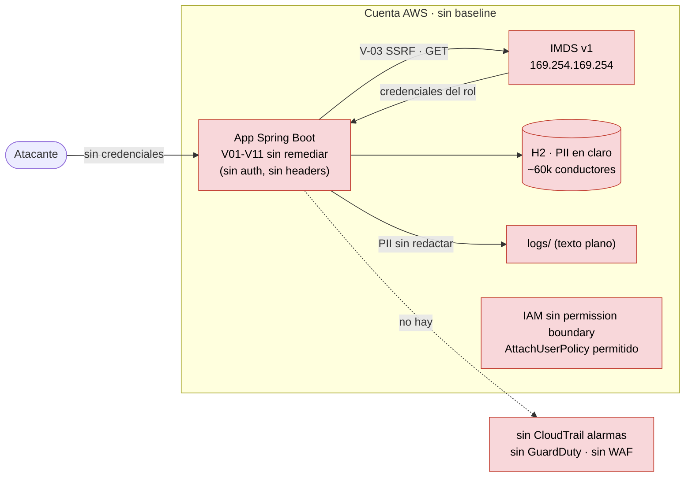
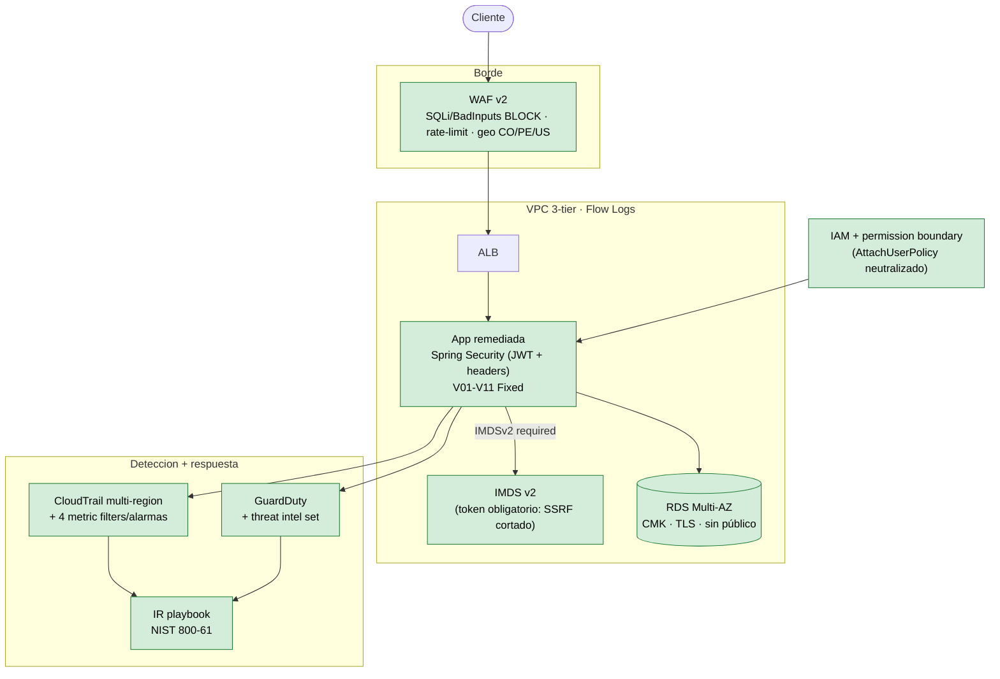
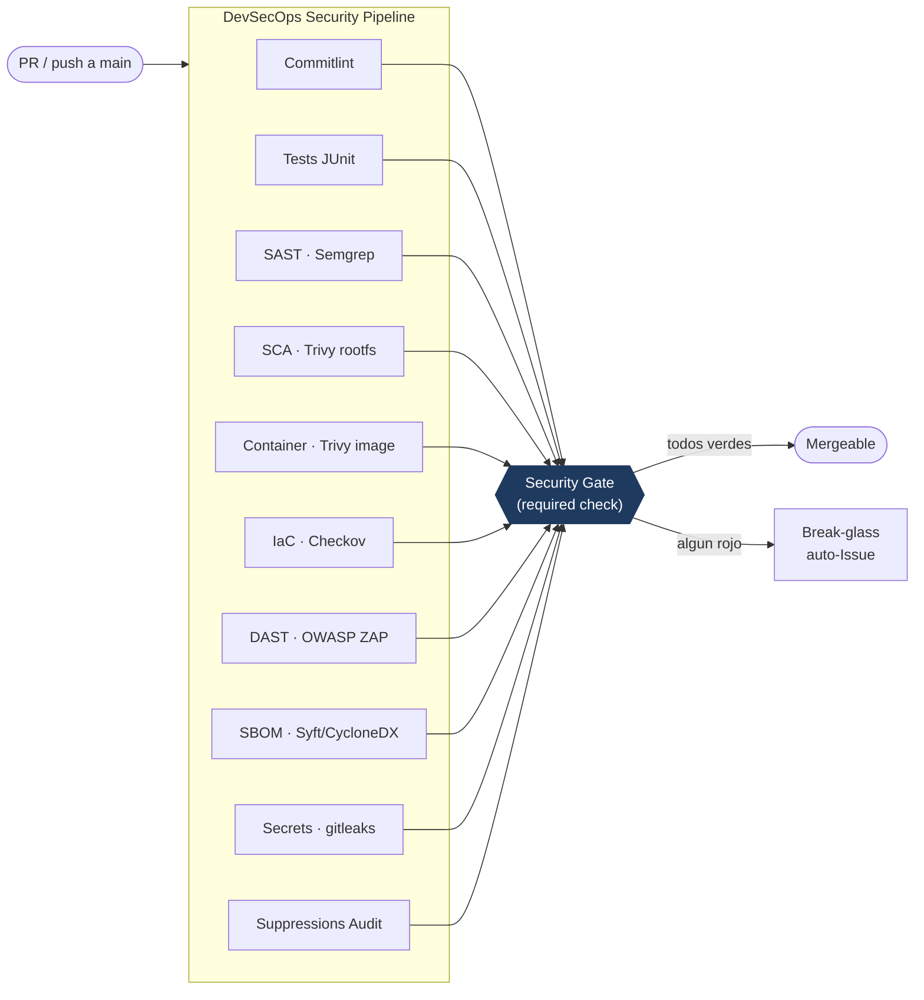
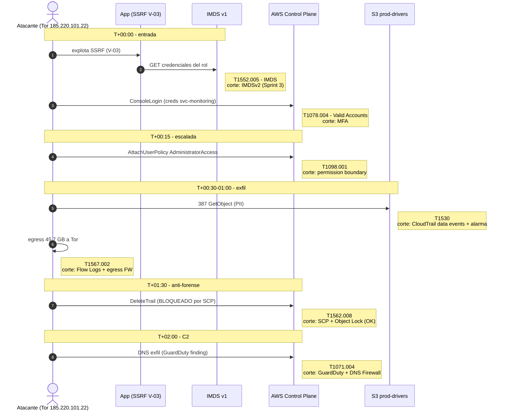

# Arquitectura · Diagramas (FSEC-29)

Diagramas Mermaid (se renderizan en GitHub). Cuentan la **narrativa de sistema**: cómo el
mismo hilo —el SSRF **V-03**— atraviesa los cuatro entregables técnicos.

---

## 1. As-is · entorno vulnerable (baseline, pre-remediación)

La app se sirve **sin autenticación**, con **IMDSv1** habilitado y sin baseline de infraestructura.
El SSRF (V-03) alcanza el IMDS y roba las credenciales del rol → la puerta del breach.

## 2. To-be · entorno endurecido (post-entregables)

App remediada (Sprint 2) **sobre** el baseline Terraform (Sprint 3), con detección y respuesta
de IR (Sprint 4). Cada capa corta un eslabón del breach.

## 3. Pipeline DevSecOps (9 stages → Security Gate)

Detector honesto: sobre la app vulnerable sale rojo; post-remediación, verde. El `Security Gate`
es el único *required check* y agrega los 9 stages.

## 4. Breach timeline con overlay MITRE ATT&CK (IR-2026-001)

El hilo completo: el SSRF (V-03 / **T1552.005**) es el vector de entrada; cada paso mapea a una
técnica y a la capa del baseline (Sprint 3) que lo habría cortado.

---

> **Fuentes:** MITRE ATT&CK v14 · NIST SP 800-61 r2. El detalle de cada técnica está en
> [`ir/mitre-mapping.md`](../../ir/mitre-mapping.md); la cadena causal en [`ir/rca.md`](../../ir/rca.md).
