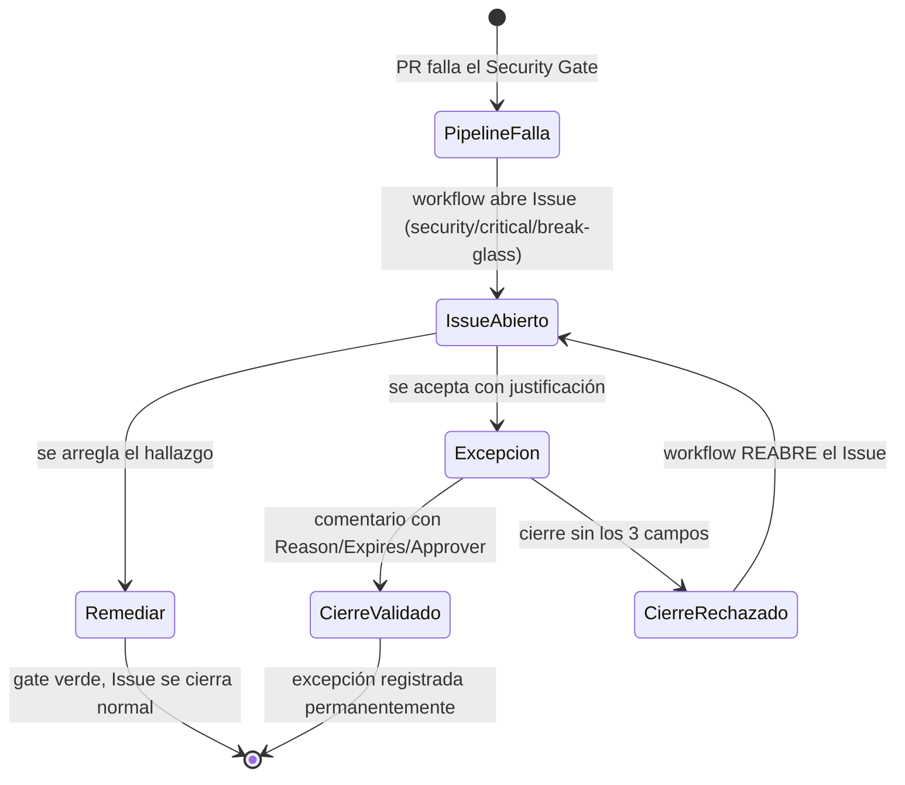

# Break-glass workflow · FleetSec SecOps (FSEC-14)

> **Break-glass** es el procedimiento que permite avanzar un PR cuando un gate de seguridad falla
> por una razón justificada y documentada — **nunca como atajo silencioso**. Toda excepción queda
> registrada como Issue permanente y su cierre está validado.

---

## 1. Principio

Un gate se diseñó para fallar ante un hallazgo. Saltarlo es válido **solo** con: un **motivo**, un
**plazo de expiración** y un **aprobador**. Una excepción sin esos tres elementos es deuda invisible
y está **prohibida**. El break-glass hace la excepción **ruidosa y auditable**, no fácil.

## 2. Flujo (implementado)



1. **Disparo automático** — cuando el pipeline *DevSecOps Security Pipeline* falla en un PR,
   [`break-glass-issue.yml`](../.github/workflows/break-glass-issue.yml) abre un Issue con labels
   `break-glass` · `security` · `critical`, enlazando el run y explicando las opciones.
2. **Dos caminos** — (a) **remediar** el hallazgo (preferido) → el gate pasa a verde solo; o
   (b) **break-glass**: aceptar la excepción con justificación.
3. **Aprobación** — el merge del PR requiere **2 reviewers** del CODEOWNERS de paths sensibles
   (`.github/`, `terraform/`, archivos de supresión) + `security-reviewer`.
4. **Cierre validado** — el Issue break-glass **solo se cierra** con un comentario que contenga las
   tres líneas; si falta alguna, el workflow lo **reabre** automáticamente:
   ```
   Reason: <motivo específico, no genérico>
   Expires: YYYY-MM-DD
   Approver: <handle del aprobador>
   ```
5. **Registro permanente** — el Issue queda con label `break-glass` (no se borra) → auditoría.

## 3. Cuándo se activa

| Trigger | Severidad | Mecanismo |
|---|---|---|
| El `Security Gate` (required) falla en un PR | CRITICAL | `break-glass-issue.yml` (auto-Issue) |
| Suprimir un hallazgo CRITICAL sin remediar | CRITICAL | Requiere break-glass aprobado (no basta la supresión canónica) |
| Hallazgo HIGH no remediable en 7 días | HIGH | Manual: label `break-glass` en el Issue |

> Las supresiones **normales** (HIGH/MEDIUM con formato canónico de 5 campos) **no** requieren
> break-glass — se gobiernan por [`suppression-policy.md`](suppression-policy.md). El break-glass es
> para lo que un gate bloqueante rechaza (CRITICAL) o para saltar el gate mismo.

## 4. Matiz de evaluación individual (importante)

El flujo asume **2 owners distintos** aprobando (segregación de funciones). En esta **prueba
técnica individual** hay un solo autor, por lo que:

- La **automatización se implementa completa** (auto-Issue + cierre validado con regex de
  `Reason/Expires/Approver`) — el mecanismo es real y funciona.
- El **bypass del merge** lo ejecuta el admin con `gh pr merge --admin` (branch protection con
  `enforce_admins: false`), como se documenta en **[ADR-009](ADRs/ADR-009-relaxed-branch-protection-for-solo-context.md)**.
- **En producción**, los 2 reviewers y el approver del break-glass serían **personas distintas** del
  autor; la relajación es explícitamente un artefacto del contexto de evaluación, no una práctica
  recomendada.

Esta honestidad —automatizar el proceso y documentar el matiz en vez de fingir 2 personas— es
coherente con el resto del repo (supresiones auditadas, ADRs de trade-offs).

## 5. Componentes

| Componente | Archivo | Qué hace |
|---|---|---|
| Auto-Issue en fallo de gate | [`.github/workflows/break-glass-issue.yml`](../.github/workflows/break-glass-issue.yml) (job `open-on-gate-failure`) | Abre/actualiza el Issue break-glass cuando el pipeline falla en un PR |
| Cierre validado | mismo workflow (job `validate-closure`) | Reabre el Issue si el cierre no trae `Reason`/`Expires`/`Approver` |
| CODEOWNERS | [`.github/CODEOWNERS`](../.github/CODEOWNERS) | Define los reviewers requeridos en paths sensibles |

## 6. Ejemplo de cierre válido

```
Reason: CVE-2026-XXXX en dependencia transitiva sin fix upstream; no explotable en nuestra
        superficie (feature no habilitada). Riesgo aceptado por el equipo de seguridad.
Expires: 2026-11-01
Approver: @Juan1202
```

Con ese comentario, el Issue se cierra y queda archivado con el label `break-glass` para auditoría.
