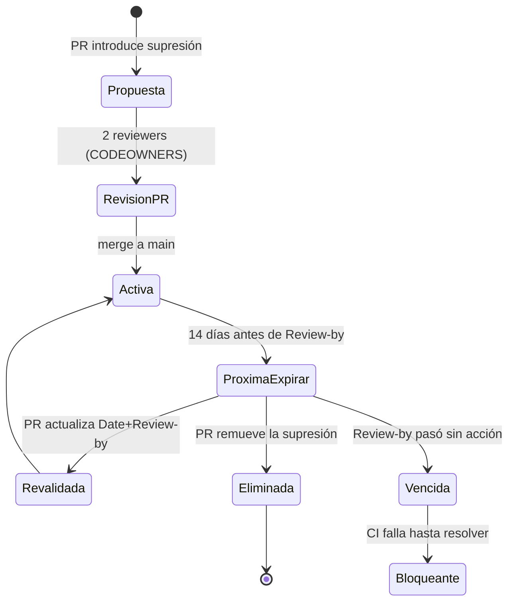

# Política de supresión auditada · FleetSec SecOps

> Cualquier supresión de un gate de seguridad (Semgrep, Trivy, Checkov, ZAP, Gitleaks) es **deuda de seguridad explícita y auditable**.
> Esta política define cómo y cuándo se permite suprimir, y cómo se audita la deuda.

---

## 1. Principio

> Un gate fue diseñado para fallar ante un hallazgo. Suprimirlo es válido solo si hay un **motivo justificado**, un **responsable**, y un **plazo de revisión**.
> Una supresión sin esos tres elementos es deuda invisible y por tanto **prohibida**.

---

## 2. Formato canónico

Toda entrada en cualquier archivo de supresión (`.semgrepignore`, `.trivyignore`, `checkov.yml`, `.gitleaks.toml`, ZAP context) DEBE incluir los siguientes 5 comentarios:

```
# Rule: <ID exacto del check — ej. CKV_AWS_24, semgrep.rules.hardcoded-jwt-secret>
# Reason: <motivo específico — NO genérico como "false positive">
# Date: YYYY-MM-DD (fecha de aplicación de la supresión)
# Responsible: <email o handle del autor>
# Review-by: YYYY-MM-DD (≤ 90 días desde Date, máximo)
```

### Ejemplo válido

```python
# .semgrepignore — entrada para suprimir falso positivo en helper de tests

# Rule: javascript.lang.security.audit.detect-non-literal-fs-filename
# Reason: Test helper que carga fixtures por nombre desde directorio sandboxed; el patrón es lectura de archivo en path validado. False positive confirmado contra OWASP Path Traversal guidance.
# Date: 2026-06-18
# Responsible: juan.andres@fleetsec.co
# Review-by: 2026-09-18
vapt/findings/V-06/test-helpers/load-fixture.js
```

### Ejemplo INVÁLIDO (CI debe bloquearlo)

```python
# False positive            ← motivo genérico, no específico
some/path/to/file.js        ← no tiene Rule, Date, Responsible, Review-by
```

---

## 3. Cuándo NO se debe suprimir

- **Reglas CRITICAL** con CVSS ≥ 9.0 — requieren remediación o break-glass aprobado por 2 owners (no supresión)
- **Hallazgos en código que toca PII** (Ley 1581) — supresión solo con justificación regulatoria documentada
- **CVEs activamente explotadas** (KEV de CISA, EPSS > 0.5) — remediar o aceptar riesgo formalmente vía CFO/CISO

---

## 4. Quién puede aprobar una supresión

- **Aplicar la supresión**: cualquier autor con permisos al repo
- **Mergear el PR con la supresión**: requiere **2 reviewers** del CODEOWNERS de paths sensibles (`.github/`, `terraform/`, archivos de supresión)
- **Excepciones HIGH/CRITICAL**: requieren además aprobación del security-reviewer + Issue de break-glass creado automáticamente

---

## 5. Auditoría

### Manual
```bash
./scripts/audit-suppressions.sh
```
Output:
- Lista todas las supresiones encontradas
- Valida que cada una tenga los 5 campos canónicos
- Reporta supresiones próximas a expirar (< 14 días)
- Reporta supresiones expiradas (Review-by ya pasó)

### Automatizada
- **CI step** en `.github/workflows/security.yml`: corre el script en cada PR y falla si encuentra entradas sin formato canónico
- **Job semanal** (`audit-suppressions.yml` con `schedule: cron 0 12 * * MON`): abre Issue automáticamente para cada supresión a < 14 días de Review-by

---

## 6. Ciclo de vida



---

## 7. Auditoría histórica

- Cada supresión tiene su origen rastreable vía `git blame` sobre el archivo
- Los Issues automáticos de break-glass quedan en el repo con label `break-glass` permanentemente
- Reporte trimestral de supresiones: ver [`scripts/quarterly-suppression-report.sh`](../scripts/) *(Sprint 1)*

---

## 8. Excepciones documentadas conocidas

### Sprint 0 (este sprint)
*Ninguna supresión activa.*

### Sprint 1+
*(Se irán agregando aquí con link al PR que las introdujo)*

---

*Última actualización: 2026-06-15*
