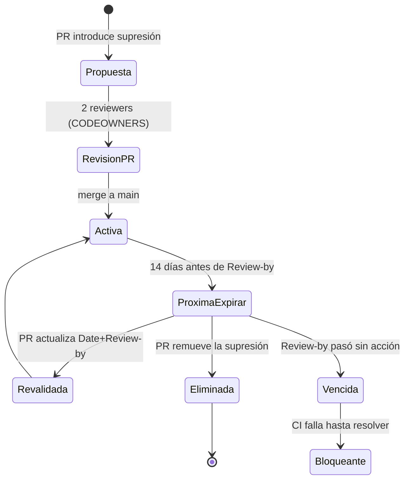

# Política de supresión auditada · FleetSec SecOps

> Cualquier supresión de un gate de seguridad (Semgrep, Trivy, Checkov, ZAP, Gitleaks) es **deuda de seguridad explícita y auditable**.
> Esta política define cómo y cuándo se permite suprimir, y cómo se audita la deuda.

---

## 1. Principio

> Un gate fue diseñado para fallar ante un hallazgo. Suprimirlo es válido solo si hay un **motivo justificado**, un **responsable**, y un **plazo de revisión**.
> Una supresión sin esos tres elementos es deuda invisible y por tanto **prohibida**.

---

## 2. Formato canónico

Toda entrada en cualquier archivo de supresión (`.semgrepignore`, `.trivyignore`, `checkov.yml`, `.gitleaks.toml`, ZAP context) DEBE incluir los siguientes 5 comentarios:

```
# Rule: <ID exacto del check — ej. CKV_AWS_24, semgrep.rules.hardcoded-jwt-secret>
# Reason: <motivo específico — NO genérico como "false positive">
# Date: YYYY-MM-DD (fecha de aplicación de la supresión)
# Responsible: <email o handle del autor>
# Review-by: YYYY-MM-DD (≤ 90 días desde Date, máximo)
```

### Ejemplo válido

```python
# .semgrepignore — entrada para suprimir falso positivo en helper de tests

# Rule: javascript.lang.security.audit.detect-non-literal-fs-filename
# Reason: Test helper que carga fixtures por nombre desde directorio sandboxed; el patrón es lectura de archivo en path validado. False positive confirmado contra OWASP Path Traversal guidance.
# Date: 2026-06-18
# Responsible: juan.andres@fleetsec.co
# Review-by: 2026-09-18
vapt/findings/V-06/test-helpers/load-fixture.js
```

### Ejemplo INVÁLIDO (CI debe bloquearlo)

```python
# False positive            ← motivo genérico, no específico
some/path/to/file.js        ← no tiene Rule, Date, Responsible, Review-by
```

---

## 3. Cuándo NO se debe suprimir

- **Reglas CRITICAL** con CVSS ≥ 9.0 — requieren remediación o break-glass aprobado por 2 owners (no supresión)
- **Hallazgos en código que toca PII** (Ley 1581) — supresión solo con justificación regulatoria documentada
- **CVEs activamente explotadas** (KEV de CISA, EPSS > 0.5) — remediar o aceptar riesgo formalmente vía CFO/CISO

---

## 4. Quién puede aprobar una supresión

- **Aplicar la supresión**: cualquier autor con permisos al repo
- **Mergear el PR con la supresión**: requiere **2 reviewers** del CODEOWNERS de paths sensibles (`.github/`, `terraform/`, archivos de supresión)
- **Excepciones HIGH/CRITICAL**: requieren además aprobación del security-reviewer + Issue de break-glass creado automáticamente

---

## 5. Auditoría

### Manual
```bash
./scripts/audit-suppressions.sh
```
Output:
- Lista todas las supresiones encontradas
- Valida que cada una tenga los 5 campos canónicos
- Reporta supresiones próximas a expirar (< 14 días)
- Reporta supresiones expiradas (Review-by ya pasó)

### Automatizada (FSEC-15)
- **Gate bloqueante** — job `Suppressions Audit` en [`.github/workflows/security.yml`](../.github/workflows/security.yml): corre el script en cada PR y **falla el build** (vía `Security Gate`, required) si alguna entrada no tiene los 5 campos o está **expirada**. Las próximas a expirar son *warning* aquí (no bloquean).
- **Job semanal** — [`.github/workflows/audit-suppressions.yml`](../.github/workflows/audit-suppressions.yml) (`schedule: 0 12 * * 1` + `workflow_dispatch`): abre/actualiza un **Issue** (label `suppression-expiry`) cuando hay supresiones a **<14 días** de Review-by o expiradas.
- **Cobertura:** el script audita `.semgrepignore`, `.trivyignore`, `.gitleaks.toml`, `checkov.yml` y `terraform/checkov.yml`, **incluyendo los bloques indentados dentro de arrays TOML** (`.gitleaks.toml`) — corregido en FSEC-15 (antes se saltaban).

---

## 6. Ciclo de vida



---

## 7. Auditoría histórica

- Cada supresión tiene su origen rastreable vía `git blame` sobre el archivo
- Los Issues automáticos de break-glass quedan en el repo con label `break-glass` permanentemente
- El job semanal [`audit-suppressions.yml`](../.github/workflows/audit-suppressions.yml) deja el rastro de expiración como Issues (`suppression-expiry`)

---

## 8. Excepciones documentadas conocidas

Estado a 2026-08-04: **16 supresiones activas, 0 inválidas, 0 expiradas** (`audit-suppressions.sh`).

| Archivo | Rule / ID | Motivo (resumen) | Review-by | Origen |
|---|---|---|---|---|
| `.trivyignore` | 8 CVEs de tomcat-embed-core | No explotables en la superficie REST (features no habilitadas) | 2026-10-31 | Sprint 1 (ADR-004) |
| `.trivyignore` | 3 CVEs de jackson-databind/core | Sin default typing ni `@JsonTypeInfo` | 2026-10-31 | Sprint 1 (ADR-004) |
| `.trivyignore` | `AWS-0104` | Egreso 443 del tier app vía NAT (sin exposición inbound) | 2026-10-31 | Sprint 3 (FSEC-20) |
| `terraform/checkov.yml` | `CKV_AWS_356/111/109/108` | `Resource="*"` inherente en key policies KMS / permission boundary / métricas CloudWatch | 2026-10-31 | Sprint 3 |
| `terraform/checkov.yml` | `CKV_AWS_144` | Single-region; durabilidad vía Object Lock | 2026-10-31 | Sprint 3 |
| `terraform/checkov.yml` | `CKV2_AWS_62` | Event notifications específicas del ambiente | 2026-10-31 | Sprint 3 |
| `terraform/checkov.yml` | `CKV2_AWS_3` | FP del provider AWS 5.x (features vía recurso nuevo) | 2026-10-31 | Sprint 3 |
| `terraform/checkov.yml` | `CKV_AWS_252` | Detección superior vía metric filters | 2026-10-31 | Sprint 3 |
| `.gitleaks.toml` | `paths` (fixtures VAPT / smoke-tests) | JWT sintéticos de PoC, no credenciales reales | 2026-09-15 / 2026-10-30 | Sprint 2 |
| `.gitleaks.toml` | `regexes` (placeholders) | Patrones de ejemplo en docs | 2026-09-15 | Sprint 0 |
| `.gitleaks.toml` | `hashicorp-tf-password` (`IAM_PASSWORD_POLICY`) | `source_identifier` de AWS Config, no un secreto | 2026-10-31 | Sprint 3 |

> El detalle completo de cada supresión (los 5 campos) vive en el propio archivo, auditable por
> `git blame` y validado por el gate `Suppressions Audit`.

---

*Última actualización: 2026-08-04 (FSEC-15)*
