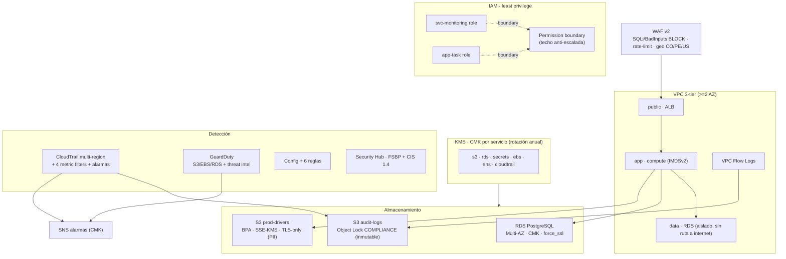

# Módulo Terraform · `security-baseline` (FleetSec, FSEC-20/21/22)

Baseline de seguridad AWS reutilizable para FleetSec: IAM con permission boundaries, CMK por
servicio, S3 endurecido (BPA + Object Lock), VPC 3-tier con Flow Logs, RDS Multi-AZ cifrado,
CloudTrail + Config + GuardDuty + Security Hub, y WAF v2. Diseñado para pasar
`terraform validate` + `checkov` + `tflint` + `trivy config` limpios, **sin `apply`**.

> **Plan-only (punto de decisión #1):** el módulo está pensado para análisis estático y
> `terraform validate`/`plan` **sin desplegar** ni requerir una cuenta AWS real. Las variables
> traen defaults sensatos; no hay `apply` en el alcance de esta entrega (evita costos AWS).

---

## Arquitectura



---

## Cómo este baseline habría mitigado el breach del Sprint 4

El escenario de brecha (que se ataca en el playbook de IR del Sprint 4) mapea capa por capa a un
control de este módulo. **El baseline es precisamente lo que lo habría prevenido o detectado:**

| Capa del breach | Control del módulo | Efecto |
|---|---|---|
| `svc-monitoring` → `AttachUserPolicy AdministratorAccess` | **Permission boundary** (`iam.tf`) | El boundary es el techo de permisos: `AdministratorAccess` queda **fuera** del máximo efectivo → el attach no surte efecto. Además el boundary **niega** explícitamente `iam:AttachUserPolicy`. |
| Exfil del bucket `prod-drivers` (PII de ~60k) | **S3 BPA + SSE-KMS + TLS-only + CloudTrail data events** (`s3.tf`, `cloudtrail.tf`) | El bucket no es accesible público; el acceso a objetos queda **trazado** (data events) → GuardDuty S3 protection lo marca como anómalo. |
| Egreso 45.7 GB a IP Tor | **VPC Flow Logs + NACL data deny-by-default** (`vpc.tf`) | El egreso masivo queda **registrado** y el tier data no tiene ruta a internet; el patrón es visible/limitable. |
| Intento `DeleteTrail` | **CloudTrail + boundary deny + metric filter** (`iam.tf`, `cloudtrail.tf`) | El boundary **niega** `cloudtrail:DeleteTrail/StopLogging`; aunque se intentara, la alarma `iam_changes`/API-no-autorizada dispara. |
| GuardDuty DNS exfil sobre una EC2 | **GuardDuty all-features + threat intel set** (`guardduty.tf`) | Detecta el DNS exfil; el threat intel set alimenta el IR con la IP Tor como IoC. |
| Detección tardía del `AttachUserPolicy` | **Metric filter `iam_changes` + alarma SNS** (`cloudtrail.tf`) | El patrón incluye `AttachUserPolicy` → alarma en ≤5 min al topic de seguridad. |

**Conexión con V-03 (VAPT):** el `metadata_options { http_tokens = "required" }` del
`launch_template.tf` fuerza **IMDSv2**, mitigando el SSRF (V-03) a nivel infraestructura —
defense-in-depth: la app se remedia en Sprint 2 (`SsrfGuard`), la infra lo refuerza aquí.

---

## Uso

```hcl
module "baseline" {
  source = "./modules/security-baseline"

  env                   = "prod"
  aws_region            = "us-east-1"
  azs                   = ["us-east-1a", "us-east-1b"]
  vpc_cidr              = "10.0.0.0/16"
  allowed_country_codes = ["CO", "PE", "US"]
  alarm_email           = "seguridad@fleetsec.co"
}
```

## Variables

| Variable | Tipo | Default | Requerida | Descripción |
|---|---|---|---|---|
| `env` | string | `"prod"` | no | Prefijo de recursos (2-21 chars). |
| `aws_region` | string | `"us-east-1"` | no | Región primaria (LATAM → us-east-1). |
| `azs` | list(string) | `["us-east-1a","us-east-1b"]` | no | AZs (≥2 para Multi-AZ). |
| `vpc_cidr` | string | `"10.0.0.0/16"` | no | CIDR de la VPC. |
| `allowed_country_codes` | list(string) | `["CO","PE","US"]` | no | Geo-allowlist del WAF. |
| `waf_rate_limit` | number | `1000` | no | Límite req/IP/5min en `/api/auth/*`. |
| `log_retention_days` | number | `365` | no | Retención de CloudWatch Log Groups. |
| `object_lock_days` | number | `365` | no | Días de inmutabilidad del bucket de logs. |
| `rds_engine_version` | string | `"16.4"` | no | Versión de PostgreSQL. |
| `alarm_email` | string | `""` | no | Email de alarmas (vacío = sin suscripción). |
| `db_rotation_lambda_arn` | string | `""` | no | Lambda de rotación del secreto (hook, 30d). |
| `tags` | map(string) | ver `variables.tf` | no | Tags comunes. |

Salidas principales: `vpc_id`, `permission_boundary_arn`, `data_bucket_arn`, `kms_key_arns`,
`waf_web_acl_arn`, `app_launch_template_id` (ver `outputs.tf`).

## Validación

```bash
cd terraform/modules/security-baseline
terraform init -backend=false && terraform validate      # Success
tflint                                                    # 0 issues
checkov -d . --config-file ../../checkov.yml              # 0 FAILED
trivy config . --ignorefile ../../../.trivyignore         # 0 misconfigurations
```

En Windows, prefijar checkov con `PYTHONUTF8=1` (evita un bug de encoding al leer comentarios UTF-8).

---

## Supresiones de Checkov y Trivy (punto de decisión #3 — a revisar por el autor)

Registradas en `terraform/checkov.yml` y `.trivyignore` con **formato canónico de 5 campos**
(validado por `scripts/audit-suppressions.sh`). Cada una corresponde a un patrón **legítimo**
donde el check es un falso positivo o no aplica a un baseline single-account/single-region — no
a "no quiero arreglarlo". Si alguna no es defendible, se arregla el recurso.

| Check | Por qué se suprime (defensa) |
|---|---|
| `CKV_AWS_356` / `CKV_AWS_111` / `CKV_AWS_109` | `Resource="*"` es correcto e inherente en **key policies de KMS** (auto-referencia a la propia clave — patrón AWS obligatorio para no perder control de la clave), en el **permission boundary** (define el techo sobre todos los recursos), y en las **APIs de métricas de CloudWatch** (`PutMetricData` no soporta permisos a nivel de recurso). No es un wildcard sobre múltiples recursos restringibles. |
| `CKV_AWS_108` | El **permission boundary** lista `s3:GetObject`/`GetSecretValue` con `*` porque es el *envelope* de máximos, no un grant efectivo; los grants reales (`app_task`) están acotados por ARN, y el boundary **niega** la escalada. |
| `CKV_AWS_144` | Cross-region replication es específico del ambiente y con costo; el baseline es single-region. La durabilidad/inmutabilidad de logs se cubre con **Object Lock COMPLIANCE** + versioning. |
| `CKV2_AWS_62` | Las S3 event notifications requieren un consumidor específico del ambiente; la trazabilidad de acceso a PII se cubre con **CloudTrail data events** + GuardDuty S3 protection. |
| `CKV2_AWS_3` | Falso positivo con el provider AWS 5.x: el detector tiene `enable=true` y las fuentes se habilitan vía `aws_guardduty_detector_feature`, que el check (esquema viejo) no reconoce. GuardDuty **está** habilitado. |
| `CKV_AWS_252` | La detección en tiempo real usa **4 metric filters + alarmas** sobre eventos reales (root, `AttachUserPolicy`, SG, API no autorizada), superior a la notificación SNS por-archivo de CloudTrail. |
| `AWS-0104` (trivy) | Egreso HTTPS del tier app a internet vía **NAT** — requerido para APIs externas/updates; es egreso (sin exposición inbound), ruteado por NAT y **monitoreado por Flow Logs**. |

## ADR relacionado

La decisión de **una CMK por servicio** (vs. una CMK compartida) está documentada en
[`docs/ADRs/ADR-011-cmk-per-service.md`](../../../docs/ADRs/ADR-011-cmk-per-service.md).
